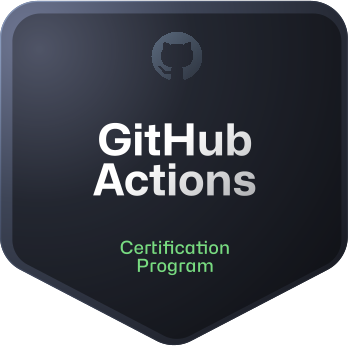

# 💫 About Me:
🚀 I build scalable cloud-native systems and automate infrastructure.  🤝 I’m looking to collaborate on distributed systems, CI/CD tooling, and infrastructure automation.  🌱 Currently diving deeper into Kubernetes internals and cloud-native architecture patterns.  💬 Ask me about DevOps pipelines, Terraform, Kafka-based systems, and production backend design.  ⚡ Fun fact: I treat infrastructure as code and failures as design feedback.

## ☁️ Cloud & DevOps Certifications

  

  

  

  

  

  

## 🌐 Socials:
  

# 💻 Tech Stack:
                          
# 📊 GitHub Stats:
 
 

## 🏆 GitHub Trophies

### 🔝 Top Contributed Repo

---

<!-- Proudly created with GPRM ( https://gprm.itsvg.in ) -->
